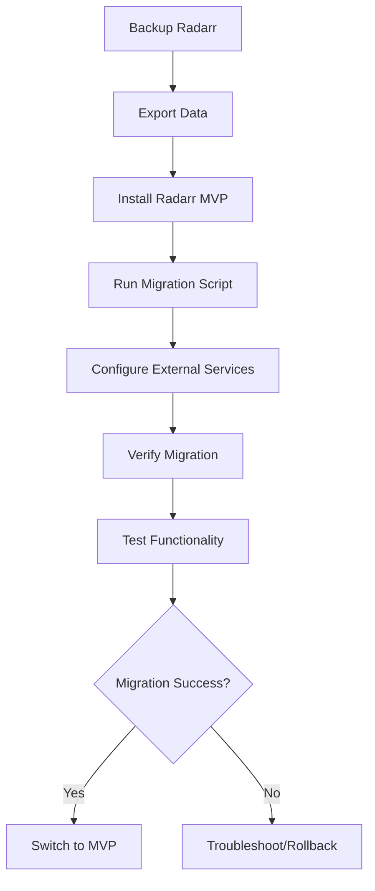

# Migration Guide

Complete guide for migrating from the official Radarr to Radarr MVP, including data transfer, configuration mapping, and troubleshooting.

## Table of Contents

1. [Before You Begin](#before-you-begin)
2. [Migration Overview](#migration-overview)
3. [Backup and Preparation](#backup-and-preparation)
4. [Data Migration](#data-migration)
5. [Configuration Mapping](#configuration-mapping)
6. [Post-Migration Setup](#post-migration-setup)
7. [Troubleshooting](#troubleshooting)
8. [Rollback Procedure](#rollback-procedure)

## Before You Begin

### Compatibility Notice

**Radarr MVP is NOT a drop-in replacement for official Radarr.** This is a complete rewrite with different:
- Database schema (PostgreSQL vs SQLite)
- Configuration format
- API endpoints (partial compatibility)
- File organization structure

### What Gets Migrated

✅ **Supported:**
- Movie library (titles, TMDB IDs, monitored status)
- Quality profiles (converted to new format)
- Download client settings (qBittorrent only)
- Indexer settings (via Prowlarr)
- Basic notification settings
- File locations and naming templates

❌ **Not Supported:**
- Historical download/import records
- Custom scripts and notifications
- Lists and import lists
- Advanced indexer configurations
- Release profiles and restrictions
- Custom formats (converted to basic quality profiles)

### Prerequisites

- **Official Radarr v4.0+** (earlier versions not supported)
- **Radarr MVP 1.0+** installed and configured
- **PostgreSQL 14+** for Radarr MVP
- **Prowlarr** for indexer management
- **Python 3.8+** for migration script
- **Backup storage** for original Radarr data

## Migration Overview

### Migration Process



### Estimated Timeline

| Library Size | Estimated Time | Notes |
|--------------|----------------|-------|
| < 500 movies | 30-60 minutes | Includes setup and testing |
| 500-2000 movies | 1-2 hours | Bulk operations may take time |
| 2000+ movies | 2-4 hours | Consider chunked migration |

## Backup and Preparation

### 1. Stop Official Radarr

```bash
# Systemd
sudo systemctl stop radarr

# Docker
docker stop radarr

# Manual
# Kill Radarr process via Task Manager or process manager
```

### 2. Backup Radarr Data

**Linux/macOS:**
```bash
# Backup entire Radarr directory
sudo cp -r /var/lib/radarr /backup/radarr-backup-$(date +%Y%m%d)

# Or backup just essential files
mkdir -p /backup/radarr-migration
cp /var/lib/radarr/radarr.db /backup/radarr-migration/
cp /var/lib/radarr/config.xml /backup/radarr-migration/
cp -r /var/lib/radarr/Backups /backup/radarr-migration/
```

**Windows:**
```cmd
# Backup to external drive or network location
xcopy "C:\ProgramData\Radarr" "D:\Backup\Radarr-Backup-%date%" /E /I

# Or use PowerShell
Copy-Item -Path "C:\ProgramData\Radarr" -Destination "D:\Backup\Radarr-Backup-$(Get-Date -Format 'yyyyMMdd')" -Recurse
```

**Docker:**
```bash
# Backup container data
docker run --rm -v radarr_data:/data -v $(pwd):/backup alpine tar czf /backup/radarr-backup.tar.gz /data

# Copy files from container
docker cp radarr:/config/radarr.db ./radarr-backup/
docker cp radarr:/config/config.xml ./radarr-backup/
```

### 3. Export Radarr Data

**Using Radarr API:**
```bash
# Get API key from Radarr settings
API_KEY="your-radarr-api-key"
RADARR_URL="http://localhost:7878"

# Export movies
curl -H "X-Api-Key: $API_KEY" "$RADARR_URL/api/v3/movie" > movies.json

# Export quality profiles
curl -H "X-Api-Key: $API_KEY" "$RADARR_URL/api/v3/qualityprofile" > quality_profiles.json

# Export download clients
curl -H "X-Api-Key: $API_KEY" "$RADARR_URL/api/v3/downloadclient" > download_clients.json

# Export indexers
curl -H "X-Api-Key: $API_KEY" "$RADARR_URL/api/v3/indexer" > indexers.json

# Export system status
curl -H "X-Api-Key: $API_KEY" "$RADARR_URL/api/v3/system/status" > system_status.json
```

**Alternative: Direct Database Export**
```bash
# Extract from SQLite database
sqlite3 radarr.db <<EOF
.headers on
.mode csv
.output movies.csv
SELECT Id, Title, Year, TmdbId, Monitored, QualityProfileId, Path FROM Movies;
.quit
EOF
```

## Data Migration

### Migration Script

Create `migrate_radarr.py`:

```python
#!/usr/bin/env python3
"""
Radarr to Radarr MVP Migration Script

Migrates movies, quality profiles, and basic configuration
from official Radarr to Radarr MVP.
"""

import json
import sqlite3
import requests
import sys
import time
from typing import Dict, List, Optional
from urllib.parse import urljoin

class RadarrMigrator:
    def __init__(self, 
                 source_db: str,
                 target_api_url: str, 
                 target_api_key: str,
                 source_api_url: Optional[str] = None,
                 source_api_key: Optional[str] = None):
        self.source_db = source_db
        self.target_api_url = target_api_url.rstrip('/')
        self.target_api_key = target_api_key
        self.source_api_url = source_api_url
        self.source_api_key = source_api_key
        
        self.session = requests.Session()
        self.session.headers.update({
            'X-Api-Key': target_api_key,
            'Content-Type': 'application/json'
        })
    
    def migrate_all(self):
        """Run complete migration process."""
        print("Starting Radarr to Radarr MVP migration...")
        
        try:
            # Step 1: Verify target system
            self.verify_target_system()
            
            # Step 2: Migrate quality profiles
            quality_profile_mapping = self.migrate_quality_profiles()
            
            # Step 3: Migrate movies
            self.migrate_movies(quality_profile_mapping)
            
            # Step 4: Basic configuration
            self.migrate_basic_config()
            
            print("\n✅ Migration completed successfully!")
            print("📝 Please review the configuration and test functionality.")
            
        except Exception as e:
            print(f"\n❌ Migration failed: {e}")
            sys.exit(1)
    
    def verify_target_system(self):
        """Verify Radarr MVP is accessible and healthy."""
        print("🔍 Verifying target system...")
        
        try:
            response = self.session.get(f"{self.target_api_url}/health")
            response.raise_for_status()
            
            health = response.json()
            if health.get('status') != 'healthy':
                raise Exception(f"Target system not healthy: {health}")
            
            print(f"✅ Target system healthy: {health.get('service')} v{health.get('version')}")
            
        except requests.RequestException as e:
            raise Exception(f"Cannot connect to Radarr MVP: {e}")
    
    def migrate_quality_profiles(self) -> Dict[int, str]:
        """Migrate quality profiles and return mapping of old ID to new ID."""
        print("\n📊 Migrating quality profiles...")
        
        # Get existing profiles from source
        if self.source_api_url and self.source_api_key:
            source_profiles = self.get_source_quality_profiles_api()
        else:
            source_profiles = self.get_source_quality_profiles_db()
        
        # Get existing profiles from target
        response = self.session.get(f"{self.target_api_url}/api/v3/qualityprofile")
        target_profiles = response.json().get('data', [])
        
        mapping = {}
        
        for source_profile in source_profiles:
            # Check if profile already exists
            existing = next(
                (p for p in target_profiles if p['name'] == source_profile['name']), 
                None
            )
            
            if existing:
                mapping[source_profile['id']] = existing['id']
                print(f"  📌 Using existing profile: {source_profile['name']}")
                continue
            
            # Convert to Radarr MVP format
            mvp_profile = self.convert_quality_profile(source_profile)
            
            try:
                response = self.session.post(
                    f"{self.target_api_url}/api/v3/qualityprofile",
                    json=mvp_profile
                )
                response.raise_for_status()
                
                new_profile = response.json()
                mapping[source_profile['id']] = new_profile['id']
                print(f"  ✅ Created profile: {source_profile['name']}")
                
            except requests.RequestException as e:
                print(f"  ⚠️  Failed to create profile {source_profile['name']}: {e}")
                # Use default profile as fallback
                default_profile = target_profiles[0] if target_profiles else None
                if default_profile:
                    mapping[source_profile['id']] = default_profile['id']
        
        return mapping
    
    def migrate_movies(self, quality_profile_mapping: Dict[int, str]):
        """Migrate movie library."""
        print("\n🎬 Migrating movies...")
        
        # Get movies from source
        if self.source_api_url and self.source_api_key:
            source_movies = self.get_source_movies_api()
        else:
            source_movies = self.get_source_movies_db()
        
        print(f"  📦 Found {len(source_movies)} movies to migrate")
        
        # Get existing movies from target
        response = self.session.get(f"{self.target_api_url}/api/v3/movie")
        existing_movies = response.json().get('data', [])
        existing_tmdb_ids = {movie['tmdb_id'] for movie in existing_movies}
        
        migrated = 0
        skipped = 0
        failed = 0
        
        for movie in source_movies:
            if movie['tmdb_id'] in existing_tmdb_ids:
                skipped += 1
                continue
            
            # Convert to MVP format
            mvp_movie = self.convert_movie(movie, quality_profile_mapping)
            
            try:
                response = self.session.post(
                    f"{self.target_api_url}/api/v3/movie",
                    json=mvp_movie
                )
                response.raise_for_status()
                migrated += 1
                
                if migrated % 50 == 0:
                    print(f"  📈 Migrated {migrated} movies...")
                
                # Rate limiting
                time.sleep(0.1)
                
            except requests.RequestException as e:
                failed += 1
                print(f"  ❌ Failed to migrate {movie['title']}: {e}")
        
        print(f"  ✅ Migration complete: {migrated} migrated, {skipped} skipped, {failed} failed")
    
    def get_source_movies_db(self) -> List[Dict]:
        """Get movies from SQLite database."""
        conn = sqlite3.connect(self.source_db)
        conn.row_factory = sqlite3.Row
        
        cursor = conn.execute("""
            SELECT Id, Title, Year, TmdbId, Monitored, QualityProfileId, Path
            FROM Movies
            WHERE TmdbId > 0
        """)
        
        movies = []
        for row in cursor:
            movies.append({
                'id': row['Id'],
                'title': row['Title'],
                'year': row['Year'],
                'tmdb_id': row['TmdbId'],
                'monitored': bool(row['Monitored']),
                'quality_profile_id': row['QualityProfileId'],
                'path': row['Path']
            })
        
        conn.close()
        return movies
    
    def convert_movie(self, source_movie: Dict, quality_mapping: Dict[int, str]) -> Dict:
        """Convert source movie to MVP format."""
        quality_profile_id = quality_mapping.get(
            source_movie['quality_profile_id'],
            list(quality_mapping.values())[0] if quality_mapping else None
        )
        
        return {
            'tmdb_id': source_movie['tmdb_id'],
            'title': source_movie['title'],
            'year': source_movie.get('year'),
            'monitored': source_movie['monitored'],
            'quality_profile_id': quality_profile_id,
            'search_on_add': False  # Don't trigger search during migration
        }
    
    def convert_quality_profile(self, source_profile: Dict) -> Dict:
        """Convert source quality profile to MVP format."""
        # Basic conversion - MVP has simpler quality system
        return {
            'name': source_profile['name'],
            'cutoff': 'Bluray-1080p',  # Default cutoff
            'items': [
                {'quality': 'HDTV-720p', 'allowed': True, 'preferred': False},
                {'quality': 'HDTV-1080p', 'allowed': True, 'preferred': False},
                {'quality': 'WEBRip-720p', 'allowed': True, 'preferred': False},
                {'quality': 'WEBRip-1080p', 'allowed': True, 'preferred': True},
                {'quality': 'Bluray-720p', 'allowed': True, 'preferred': False},
                {'quality': 'Bluray-1080p', 'allowed': True, 'preferred': True}
            ],
            'upgrade_allowed': True,
            'min_format_score': 0
        }
    
    def migrate_basic_config(self):
        """Migrate basic configuration settings."""
        print("\n⚙️  Basic configuration notes:")
        print("  📋 Manual configuration required for:")
        print("     • Prowlarr integration (indexers)")
        print("     • qBittorrent connection")
        print("     • Download paths and naming")
        print("     • Notifications (Discord/Webhook)")
        print("  📖 See CONFIG.md for detailed setup")

if __name__ == '__main__':
    import argparse
    
    parser = argparse.ArgumentParser(description='Migrate from Radarr to Radarr MVP')
    parser.add_argument('--source-db', required=True, help='Path to source radarr.db')
    parser.add_argument('--target-url', default='http://localhost:7878', help='Radarr MVP URL')
    parser.add_argument('--target-key', required=True, help='Radarr MVP API key')
    parser.add_argument('--source-url', help='Source Radarr URL (optional)')
    parser.add_argument('--source-key', help='Source Radarr API key (optional)')
    
    args = parser.parse_args()
    
    migrator = RadarrMigrator(
        source_db=args.source_db,
        target_api_url=args.target_url,
        target_api_key=args.target_key,
        source_api_url=args.source_url,
        source_api_key=args.source_key
    )
    
    migrator.migrate_all()
```

### Running the Migration

```bash
# Install dependencies
pip3 install requests

# Make script executable
chmod +x migrate_radarr.py

# Run migration
python3 migrate_radarr.py \
  --source-db /backup/radarr-migration/radarr.db \
  --target-url http://localhost:7878 \
  --target-key your-radarr-mvp-api-key

# With source API (if Radarr is still running)
python3 migrate_radarr.py \
  --source-url http://localhost:7878 \
  --source-key your-original-radarr-api-key \
  --target-url http://localhost:7879 \
  --target-key your-radarr-mvp-api-key
```

## Configuration Mapping

### Quality Profiles

| Original Radarr | Radarr MVP | Notes |
|----------------|------------|-------|
| Custom Formats | Basic Quality Items | Simplified system |
| Advanced Scoring | Min Format Score | Basic scoring only |
| Language Profiles | Single Language | English default |
| Release Profiles | Not supported | Use Prowlarr filters |

### Download Clients

| Original | MVP Support | Migration Notes |
|----------|-------------|----------------|
| qBittorrent | ✅ Full | Direct migration |
| Deluge | ❌ Not supported | Switch to qBittorrent |
| Transmission | ❌ Not supported | Switch to qBittorrent |
| SABnzbd | ❌ Not supported | Usenet not in MVP |
| NZBGet | ❌ Not supported | Usenet not in MVP |

### Indexers

| Original | MVP Approach | Migration |
|----------|--------------|----------|
| Built-in indexers | Prowlarr only | Configure Prowlarr |
| Jackett | Prowlarr | Migrate to Prowlarr |
| Custom indexers | Prowlarr | Add to Prowlarr |

### Paths and Naming

**Original Radarr Naming:**
```
{Movie Title} ({Release Year}) [imdbid-{ImdbId}] - {Edition Tags} [{Quality Full}]
```

**Radarr MVP Naming:**
```
{Movie Title} ({Release Year}) - {Quality}[{MediaInfo}]
```

**Path Mapping:**
```bash
# Update environment variables
IMPORT_MOVIE_PATH=/original/movie/path
IMPORT_DOWNLOAD_PATH=/original/download/path
IMPORT_MOVIE_NAMING="{Movie Title} ({Release Year}) [{Quality}]"
```

## Post-Migration Setup

### 1. Configure External Services

**Setup Prowlarr:**
```bash
# Install Prowlarr if not already installed
docker run -d --name prowlarr \
  -p 9696:9696 \
  -v ./prowlarr-config:/config \
  lscr.io/linuxserver/prowlarr:latest

# Add indexers to Prowlarr
# Get API key from Prowlarr settings
# Add to Radarr MVP environment:
PROWLARR_BASE_URL=http://localhost:9696
PROWLARR_API_KEY=your_prowlarr_api_key
```

**Configure qBittorrent:**
```bash
# Update Radarr MVP environment
QBITTORRENT_BASE_URL=http://localhost:8080
QBITTORRENT_USERNAME=your_username
QBITTORRENT_PASSWORD=your_password
QBITTORRENT_CATEGORY=movies
```

### 2. Verify Movie Files

```bash
# Run import scan to detect existing files
curl -X POST -H "X-Api-Key: your-api-key" \
  -H "Content-Type: application/json" \
  -d '{"name": "import"}' \
  http://localhost:7878/api/v3/command

# Check import status
curl -H "X-Api-Key: your-api-key" \
  http://localhost:7878/api/v3/command
```

### 3. Test Core Functionality

```bash
# Test API health
curl -H "X-Api-Key: your-api-key" http://localhost:7878/health

# List migrated movies
curl -H "X-Api-Key: your-api-key" http://localhost:7878/api/v3/movie

# Test search functionality
curl -X POST -H "X-Api-Key: your-api-key" \
  -H "Content-Type: application/json" \
  -d '{"name": "search", "movie_id": "movie-uuid"}' \
  http://localhost:7878/api/v3/command
```

### 4. Update Automation

**Update scripts and tools:**
```bash
# Update any scripts that call Radarr API
# Change URL from http://localhost:7878 to new instance
# Update API endpoints if using v1/v2 APIs

# Update reverse proxy configuration
# Update monitoring and alerting
# Update backup scripts
```

## Troubleshooting

### Common Issues

#### Migration Script Failures

**Database locked:**
```bash
# Error: database is locked
# Solution: Ensure original Radarr is stopped
sudo systemctl stop radarr
lsof /path/to/radarr.db  # Check for open files
```

**API connection errors:**
```bash
# Error: Connection refused
# Check Radarr MVP is running
curl http://localhost:7878/health

# Check API key is correct
grep API_KEY /path/to/radarr-mvp/.env
```

**Missing TMDB IDs:**
```bash
# Some movies may not have TMDB IDs
# Check source database
sqlite3 radarr.db "SELECT COUNT(*) FROM Movies WHERE TmdbId = 0;"

# Manual lookup required for these movies
```

#### Quality Profile Issues

**Unsupported quality formats:**
```
ERROR: Quality 'Bluray-4K' not supported in MVP

SOLUTION:
1. Map to supported quality (Bluray-2160p)
2. Update migration script quality mapping
3. Create custom quality profile in MVP
```

#### File Import Issues

**Permission errors:**
```bash
# Ensure MVP has access to movie files
sudo chown -R radarr:radarr /movies
sudo chmod -R 755 /movies

# Check mount points are accessible
df -h | grep /movies
```

**Hardlink failures:**
```bash
# Hardlinks require same filesystem
# Check if download and movie paths are on same filesystem
df /downloads /movies

# If different filesystems, disable hardlinks
IMPORT_USE_HARDLINKS=false
```

### Debug Information

```bash
# Enable debug logging
RUST_LOG=debug cargo run

# Check database connection
psql "$DATABASE_URL" -c "SELECT COUNT(*) FROM movies;"

# Test external services
curl -H "X-Api-Key: $PROWLARR_API_KEY" \
  http://localhost:9696/api/v1/indexer

curl -u "$QBITTORRENT_USERNAME:$QBITTORRENT_PASSWORD" \
  http://localhost:8080/api/v2/app/version
```

### Performance Issues

**Slow migration:**
```python
# Increase batch size in migration script
BATCH_SIZE = 100  # Process 100 movies at once

# Reduce API delays
time.sleep(0.05)  # Reduce from 0.1 to 0.05

# Use database transactions
with conn.begin() as transaction:
    # Batch database operations
```

**High memory usage:**
```bash
# Monitor memory during migration
ps aux | grep radarr-mvp
htop -p $(pgrep radarr-mvp)

# Increase database connection pool if needed
DATABASE_MAX_CONNECTIONS=30
```

## Rollback Procedure

### If Migration Fails

1. **Stop Radarr MVP:**
   ```bash
   sudo systemctl stop radarr-mvp
   # or
   docker stop radarr-mvp
   ```

2. **Restore Original Radarr:**
   ```bash
   # Restore from backup
   sudo cp -r /backup/radarr-backup-20240115/* /var/lib/radarr/
   
   # Start original Radarr
   sudo systemctl start radarr
   ```

3. **Verify Original System:**
   ```bash
   curl http://localhost:7878/api/v3/system/status
   ```

### If Migration Succeeds but Issues Found

1. **Keep both systems running temporarily**
2. **Compare functionality side by side**
3. **Gradually migrate services (reverse proxy, scripts, etc.)**
4. **Monitor for 24-48 hours before decommissioning original**

### Clean Decommissioning

```bash
# After successful migration and testing

# Stop original Radarr
sudo systemctl stop radarr
sudo systemctl disable radarr

# Archive original data
sudo tar czf /backup/radarr-final-backup.tar.gz /var/lib/radarr

# Remove original installation (optional)
sudo apt remove radarr  # or equivalent for your system

# Update startup services
sudo systemctl enable radarr-mvp
```

## Migration Checklist

### Pre-Migration
- [ ] Backup original Radarr completely
- [ ] Export all data via API
- [ ] Install and configure Radarr MVP
- [ ] Install and configure Prowlarr
- [ ] Install migration script dependencies
- [ ] Test Radarr MVP with sample data

### During Migration
- [ ] Stop original Radarr
- [ ] Run migration script
- [ ] Monitor migration progress
- [ ] Address any errors promptly
- [ ] Verify movie count matches

### Post-Migration
- [ ] Configure external services (Prowlarr, qBittorrent)
- [ ] Run import scan
- [ ] Test search functionality
- [ ] Test download functionality
- [ ] Update automation scripts
- [ ] Update monitoring/alerting
- [ ] Test notifications
- [ ] Run for 24-48 hours alongside original
- [ ] Migrate traffic (reverse proxy, DNS)
- [ ] Archive original system

### Validation Tests

```bash
#!/bin/bash
# Migration validation script

API_KEY="your-api-key"
BASE_URL="http://localhost:7878"

echo "Testing Radarr MVP after migration..."

# Test health
echo "1. Health check..."
curl -s -H "X-Api-Key: $API_KEY" "$BASE_URL/health" | jq '.status'

# Test movie count
echo "2. Movie count..."
MOVIE_COUNT=$(curl -s -H "X-Api-Key: $API_KEY" "$BASE_URL/api/v3/movie" | jq '.pagination.total')
echo "Movies in library: $MOVIE_COUNT"

# Test quality profiles
echo "3. Quality profiles..."
PROFILE_COUNT=$(curl -s -H "X-Api-Key: $API_KEY" "$BASE_URL/api/v3/qualityprofile" | jq '.data | length')
echo "Quality profiles: $PROFILE_COUNT"

# Test external services
echo "4. External services..."
HEALTH=$(curl -s -H "X-Api-Key: $API_KEY" "$BASE_URL/health/detailed")
echo "Prowlarr: $(echo "$HEALTH" | jq -r '.components.prowlarr.status')"
echo "qBittorrent: $(echo "$HEALTH" | jq -r '.components.qbittorrent.status')"

echo "Migration validation complete!"
```

## Support and Resources

- **GitHub Issues:** Report migration problems
- **Community Discord:** Get help from other users
- **Documentation:** [CONFIG.md](CONFIG.md) for detailed configuration
- **API Reference:** [API.md](API.md) for endpoint documentation

Remember: Migration is a one-way process. Always keep your backups until you're completely satisfied with the new system!