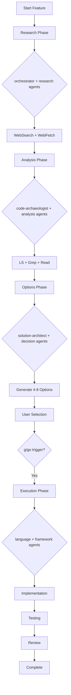

# 🤖 Complete Agent Registry for Architecture Mode

## Overview
This project integrates 100+ specialized agents from Claude Code Studio and awesome-claude-code-subagents, organized for Architecture Mode phases.

## 🏗️ Architecture Mode Agent Assignments

### Phase 1: Research (PLANNING MODE)
**Model**: opus-4.1
**Tools**: WebSearch, WebFetch (MANDATORY)

#### Primary Research Agents
- **orchestrator** - Coordinates multi-agent research workflows
- **context-manager** - Maintains project context and knowledge
- **research-specialist** - Deep dive research and analysis
- **trend-researcher** - Market and technology trend analysis

### Phase 2: Analysis (PLANNING MODE)
**Model**: opus-4.1
**Tools**: LS, Grep, Read (MANDATORY)

#### Primary Analysis Agents
- **code-archaeologist** - Explores legacy code patterns
- **dependency-mapper** - Maps project dependencies
- **architecture-reviewer** - Analyzes system architecture
- **pattern-detector** - Identifies code patterns and anti-patterns

### Phase 3: Options Generation (PLANNING MODE)
**Model**: opus-4.1

#### Primary Options Agents
- **solution-architect** - Generates architectural options
- **decision-expert** - Creates decision matrices
- **trade-off-analyzer** - Evaluates pros/cons
- **complexity-estimator** - Estimates implementation complexity

### Phase 4: Execution (EXECUTION MODE)
**Model**: sonnet-4
**Trigger**: Requires "g" or "go" command

#### Primary Execution Agents
See category-specific agents below

## 📚 Agent Categories

### 01 - Core Development Agents

#### backend-developer
- **Specialization**: Server-side architecture, APIs, microservices
- **Architecture Mode**: EXECUTION
- **Model**: sonnet-4
- **Auto-activates**: API endpoints, database operations, auth systems
- **Tools**: Read, Write, MultiEdit, Bash, npm, pip

#### frontend-developer
- **Specialization**: React, Vue, Angular, responsive design
- **Architecture Mode**: EXECUTION
- **Model**: sonnet-4
- **Auto-activates**: UI components, state management, styling
- **Tools**: Read, Write, MultiEdit, npm, webpack

#### fullstack-developer
- **Specialization**: End-to-end feature development
- **Architecture Mode**: EXECUTION
- **Model**: sonnet-4
- **Auto-activates**: Complete features spanning frontend/backend
- **Tools**: All development tools

#### mobile-developer
- **Specialization**: React Native, Flutter, native mobile
- **Architecture Mode**: EXECUTION
- **Model**: sonnet-4
- **Auto-activates**: Mobile app features, native integrations
- **Tools**: Read, Write, xcode, gradle

#### api-architect
- **Specialization**: REST, GraphQL, WebSocket design
- **Architecture Mode**: PLANNING
- **Model**: opus-4.1
- **Auto-activates**: API design, schema definition, versioning
- **Tools**: Read, Write, openapi, graphql

### 02 - Language Specialists

#### rust-specialist
- **Specialization**: Rust systems programming, async, safety
- **Architecture Mode**: EXECUTION
- **Model**: sonnet-4
- **Auto-activates**: Rust code, cargo operations, memory management
- **Tools**: cargo, rustc, clippy, rustfmt

#### python-pro
- **Specialization**: Python 3.11+, type safety, async
- **Architecture Mode**: EXECUTION
- **Model**: sonnet-4
- **Auto-activates**: Python development, data science, automation
- **Tools**: pip, pytest, black, mypy, poetry

#### typescript-guru
- **Specialization**: TypeScript, type systems, generics
- **Architecture Mode**: EXECUTION
- **Model**: sonnet-4
- **Auto-activates**: TypeScript code, type definitions, tsconfig
- **Tools**: tsc, npm, eslint, prettier

#### go-expert
- **Specialization**: Go concurrency, channels, performance
- **Architecture Mode**: EXECUTION
- **Model**: sonnet-4
- **Auto-activates**: Go development, goroutines, modules
- **Tools**: go, gofmt, go test, go mod

#### java-master
- **Specialization**: Java, Spring, enterprise patterns
- **Architecture Mode**: EXECUTION
- **Model**: sonnet-4
- **Auto-activates**: Java code, Spring Boot, Maven/Gradle
- **Tools**: javac, maven, gradle, junit

### 03 - DevOps & Infrastructure

#### devops-engineer
- **Specialization**: CI/CD, automation, deployment
- **Architecture Mode**: BOTH
- **Model**: sonnet-4
- **Auto-activates**: Pipeline configuration, deployment scripts
- **Tools**: docker, kubectl, terraform, ansible

#### cloud-architect
- **Specialization**: AWS, Azure, GCP, cloud patterns
- **Architecture Mode**: PLANNING
- **Model**: opus-4.1
- **Auto-activates**: Cloud infrastructure, scaling, cost optimization
- **Tools**: aws-cli, terraform, cloudformation

#### kubernetes-specialist
- **Specialization**: K8s, Helm, operators, clusters
- **Architecture Mode**: EXECUTION
- **Model**: sonnet-4
- **Auto-activates**: K8s manifests, deployments, services
- **Tools**: kubectl, helm, kustomize

#### docker-specialist
- **Specialization**: Containers, Compose, optimization
- **Architecture Mode**: EXECUTION
- **Model**: sonnet-4
- **Auto-activates**: Dockerfiles, compose files, registries
- **Tools**: docker, docker-compose

#### terraform-expert
- **Specialization**: Infrastructure as Code, providers
- **Architecture Mode**: EXECUTION
- **Model**: sonnet-4
- **Auto-activates**: Terraform configurations, modules, state
- **Tools**: terraform, terragrunt

### 04 - Quality & Security

#### test-engineer
- **Specialization**: Unit, integration, E2E testing
- **Architecture Mode**: EXECUTION
- **Model**: sonnet-4
- **Auto-activates**: Test creation, test coverage, TDD
- **Tools**: jest, pytest, cypress, selenium

#### code-reviewer
- **Specialization**: Code quality, best practices, refactoring
- **Architecture Mode**: BOTH
- **Model**: sonnet-4
- **Auto-activates**: Code reviews, quality checks, standards
- **Tools**: eslint, pylint, sonarqube

#### security-auditor
- **Specialization**: Security vulnerabilities, OWASP, penetration
- **Architecture Mode**: PLANNING
- **Model**: opus-4.1
- **Auto-activates**: Security analysis, threat modeling, audits
- **Tools**: snyk, trivy, owasp-zap

#### performance-engineer
- **Specialization**: Optimization, profiling, benchmarking
- **Architecture Mode**: BOTH
- **Model**: opus-4.1
- **Auto-activates**: Performance issues, bottlenecks, optimization
- **Tools**: profilers, load testing tools

#### error-detective
- **Specialization**: Debugging, root cause analysis
- **Architecture Mode**: EXECUTION
- **Model**: sonnet-4
- **Auto-activates**: Error analysis, stack traces, debugging
- **Tools**: debuggers, logging tools

### 05 - Data & AI

#### data-engineer
- **Specialization**: ETL, pipelines, data warehousing
- **Architecture Mode**: EXECUTION
- **Model**: sonnet-4
- **Auto-activates**: Data pipelines, transformations, warehouses
- **Tools**: spark, airflow, dbt

#### ml-engineer
- **Specialization**: ML ops, model deployment, pipelines
- **Architecture Mode**: EXECUTION
- **Model**: sonnet-4
- **Auto-activates**: ML workflows, model serving, monitoring
- **Tools**: mlflow, kubeflow, tensorflow

#### ai-engineer
- **Specialization**: AI systems, LLMs, embeddings
- **Architecture Mode**: BOTH
- **Model**: opus-4.1
- **Auto-activates**: AI integration, prompts, RAG systems
- **Tools**: langchain, openai, huggingface

#### data-scientist
- **Specialization**: Analysis, visualization, statistics
- **Architecture Mode**: PLANNING
- **Model**: opus-4.1
- **Auto-activates**: Data analysis, experiments, insights
- **Tools**: pandas, numpy, matplotlib, jupyter

#### database-architect
- **Specialization**: Schema design, optimization, migrations
- **Architecture Mode**: PLANNING
- **Model**: opus-4.1
- **Auto-activates**: Database design, queries, indexing
- **Tools**: sql, nosql, migration tools

### 06 - UI/UX & Design

#### ui-designer
- **Specialization**: Interface design, component systems
- **Architecture Mode**: PLANNING
- **Model**: opus-4.1
- **Auto-activates**: UI mockups, design systems, components
- **Tools**: figma, sketch, design tools

#### ux-researcher
- **Specialization**: User research, usability, personas
- **Architecture Mode**: PLANNING
- **Model**: opus-4.1
- **Auto-activates**: User flows, research, testing
- **Tools**: analytics, survey tools

#### accessibility-specialist
- **Specialization**: WCAG, ARIA, inclusive design
- **Architecture Mode**: BOTH
- **Model**: sonnet-4
- **Auto-activates**: Accessibility audits, ARIA, screen readers
- **Tools**: axe, lighthouse, screen readers

#### css-wizard
- **Specialization**: Advanced CSS, animations, layouts
- **Architecture Mode**: EXECUTION
- **Model**: sonnet-4
- **Auto-activates**: Styling, animations, responsive design
- **Tools**: sass, postcss, tailwind

### 07 - Project Management

#### orchestrator
- **Specialization**: Multi-agent coordination
- **Architecture Mode**: PLANNING
- **Model**: opus-4.1
- **Auto-activates**: Complex workflows, agent coordination
- **Tools**: agent communication protocols

#### context-manager
- **Specialization**: Project context, knowledge management
- **Architecture Mode**: BOTH
- **Model**: sonnet-4
- **Auto-activates**: Context queries, knowledge retrieval
- **Tools**: knowledge base, documentation

#### project-shipper
- **Specialization**: Delivery, deployment, release
- **Architecture Mode**: EXECUTION
- **Model**: sonnet-4
- **Auto-activates**: Release planning, deployment coordination
- **Tools**: CI/CD, release tools

#### sprint-prioritizer
- **Specialization**: Agile planning, backlog, sprints
- **Architecture Mode**: PLANNING
- **Model**: opus-4.1
- **Auto-activates**: Sprint planning, prioritization, estimation
- **Tools**: jira, trello, agile tools

### 08 - Specialized Domains

#### blockchain-developer
- **Specialization**: Smart contracts, Web3, DeFi
- **Architecture Mode**: EXECUTION
- **Model**: sonnet-4
- **Auto-activates**: Blockchain code, smart contracts, Web3
- **Tools**: truffle, hardhat, web3.js

#### game-developer
- **Specialization**: Game engines, graphics, physics
- **Architecture Mode**: EXECUTION
- **Model**: sonnet-4
- **Auto-activates**: Game logic, Unity/Unreal, graphics
- **Tools**: unity, unreal, game frameworks

#### iot-specialist
- **Specialization**: Embedded, sensors, edge computing
- **Architecture Mode**: EXECUTION
- **Model**: sonnet-4
- **Auto-activates**: IoT protocols, embedded code, sensors
- **Tools**: arduino, raspberry pi, mqtt

#### ar-vr-developer
- **Specialization**: AR/VR, 3D, immersive experiences
- **Architecture Mode**: EXECUTION
- **Model**: sonnet-4
- **Auto-activates**: AR/VR applications, 3D graphics
- **Tools**: unity, arcore, arkit

### 09 - Business & Marketing

#### growth-hacker
- **Specialization**: Growth strategies, viral loops
- **Architecture Mode**: PLANNING
- **Model**: opus-4.1
- **Auto-activates**: Growth planning, metrics, experiments
- **Tools**: analytics, a/b testing

#### content-creator
- **Specialization**: Content strategy, SEO, copywriting
- **Architecture Mode**: EXECUTION
- **Model**: sonnet-4
- **Auto-activates**: Content creation, blog posts, documentation
- **Tools**: markdown, cms, seo tools

#### social-media-strategist
- **Specialization**: Social platforms, engagement, campaigns
- **Architecture Mode**: PLANNING
- **Model**: opus-4.1
- **Auto-activates**: Social strategy, content calendars
- **Tools**: social media apis, analytics

#### sales-engineer
- **Specialization**: Technical sales, demos, solutions
- **Architecture Mode**: BOTH
- **Model**: sonnet-4
- **Auto-activates**: Technical proposals, demos, POCs
- **Tools**: presentation tools, demo environments

### 10 - Custom Media Agents (Radarr-specific)

#### parser-expert
- **Specialization**: Media release parsing, scene naming
- **Architecture Mode**: PLANNING
- **Model**: opus-4.1
- **Auto-activates**: Parser design, regex patterns, quality detection
- **Tools**: regex tools, parser generators

#### decision-expert
- **Specialization**: Scoring algorithms, quality profiles
- **Architecture Mode**: PLANNING
- **Model**: opus-4.1
- **Auto-activates**: Decision algorithms, scoring systems
- **Tools**: algorithm design tools

#### import-specialist
- **Specialization**: File operations, hardlinks, naming
- **Architecture Mode**: EXECUTION
- **Model**: sonnet-4
- **Auto-activates**: Import pipelines, file operations
- **Tools**: file system tools

#### indexer-specialist
- **Specialization**: API integration, rate limiting, RSS
- **Architecture Mode**: BOTH
- **Model**: sonnet-4
- **Auto-activates**: Indexer integration, API calls
- **Tools**: api tools, rate limiters

#### media-analyzer
- **Specialization**: MediaInfo, quality verification
- **Architecture Mode**: EXECUTION
- **Model**: sonnet-4
- **Auto-activates**: Media file analysis, metadata extraction
- **Tools**: mediainfo, ffprobe

#### quality-controller
- **Specialization**: Quality validation, standards
- **Architecture Mode**: BOTH
- **Model**: sonnet-4
- **Auto-activates**: Quality checks, validation rules
- **Tools**: validation frameworks

## 🔄 Agent Workflow Integration

### Architecture Mode Phase Flow



### Multi-Agent Coordination Examples

#### Example 1: Movie Management Feature
```yaml
Research Phase:
  - orchestrator: Coordinates research
  - trend-researcher: Analyzes movie DB trends
  - api-architect: Researches API patterns

Analysis Phase:
  - code-archaeologist: Explores existing code
  - database-architect: Analyzes schema needs
  - dependency-mapper: Maps integrations

Options Phase:
  - solution-architect: Creates 8 approaches
  - decision-expert: Builds decision matrix
  - complexity-estimator: Estimates effort

Execution Phase:
  - rust-specialist: Implements models
  - backend-developer: Creates services
  - test-engineer: Writes tests
  - code-reviewer: Reviews implementation
```

#### Example 2: Release Parser Feature
```yaml
Research Phase:
  - parser-expert: Research scene standards
  - orchestrator: Coordinate research

Analysis Phase:
  - pattern-detector: Find parsing patterns
  - code-archaeologist: Analyze existing parsers

Options Phase:
  - parser-expert: Design parser approaches
  - performance-engineer: Estimate performance

Execution Phase:
  - rust-specialist: Implement parser
  - test-engineer: Property-based tests
  - benchmark-expert: Performance testing
```

## 🎯 Agent Selection Guidelines

### For Architecture Mode Phases

1. **Research Phase (PLANNING)**
   - Always use: orchestrator, context-manager
   - Domain-specific: trend-researcher, market-analyst
   - Technical: api-architect, solution-architect

2. **Analysis Phase (PLANNING)**
   - Always use: code-archaeologist, dependency-mapper
   - Quality: pattern-detector, complexity-analyzer
   - Architecture: architecture-reviewer, system-analyst

3. **Options Phase (PLANNING)**
   - Always use: solution-architect, decision-expert
   - Evaluation: trade-off-analyzer, risk-assessor
   - Estimation: complexity-estimator, effort-calculator

4. **Execution Phase (EXECUTION)**
   - Language agents: Based on tech stack
   - Framework agents: Based on frameworks
   - Quality agents: test-engineer, code-reviewer

### By Feature Type

- **API Features**: api-architect → backend-developer → test-engineer
- **UI Features**: ui-designer → frontend-developer → accessibility-specialist
- **Data Features**: database-architect → data-engineer → performance-engineer
- **ML Features**: ai-engineer → ml-engineer → data-scientist
- **Infrastructure**: cloud-architect → devops-engineer → security-auditor

## 📊 Agent Performance Metrics

### Response Time Targets
- Planning agents (opus-4.1): < 30s
- Execution agents (sonnet-4): < 15s
- Simple agents (haiku-3.5): < 5s

### Context Usage
- Standard agent: ~13k tokens
- With MCP tools: ~18k tokens
- Full context: ~25k tokens

### Success Metrics
- Code quality: > 90% standards compliance
- Test coverage: > 80% for critical paths
- Performance: Meeting defined SLAs
- Security: Zero critical vulnerabilities

## 🔧 Agent Configuration

### Model Overrides
```json
{
  "model_overrides": {
    "orchestrator": "opus-4.1",
    "database-architect": "opus-4.1",
    "parser-expert": "opus-4.1",
    "solution-architect": "opus-4.1",
    "rust-specialist": "sonnet-4",
    "test-engineer": "sonnet-4",
    "documentation-writer": "haiku-3.5"
  }
}
```

### Tool Permissions
```json
{
  "tool_permissions": {
    "planning_agents": ["Read", "WebSearch", "WebFetch"],
    "execution_agents": ["Read", "Write", "MultiEdit", "Bash"],
    "review_agents": ["Read", "Comment"],
    "deployment_agents": ["Read", "Write", "Bash", "Deploy"]
  }
}
```

## 🚀 Advanced Usage

### Parallel Agent Execution
```bash
# Run multiple agents in parallel
"Use rust-specialist and test-engineer in parallel to implement and test the parser"
```

### Agent Chaining
```bash
# Chain agents for complex workflows
"Start with database-architect for schema, then backend-developer for models, finally test-engineer for tests"
```

### Custom Agent Combinations
```bash
# Create custom agent teams
"Form a team with parser-expert, rust-specialist, and benchmark-expert for the parsing system"
```

## 📝 Notes

- All agents support Architecture Mode phases
- Agents automatically respect PLANNING vs EXECUTION modes
- Context is preserved between agent switches
- Agents can communicate via standardized protocols
- Each agent has specialized prompts and tools
- Model selection optimizes for cost/performance

## 🔗 Resources

- [Claude Code Studio](https://github.com/arnaldo-delisio/claude-code-studio)
- [Awesome Subagents](https://github.com/VoltAgent/awesome-claude-code-subagents)
- [Architecture Mode Guide](../architecture-mode/GUIDE.md)
- [Workflow Documentation](../workflows/README.md)
